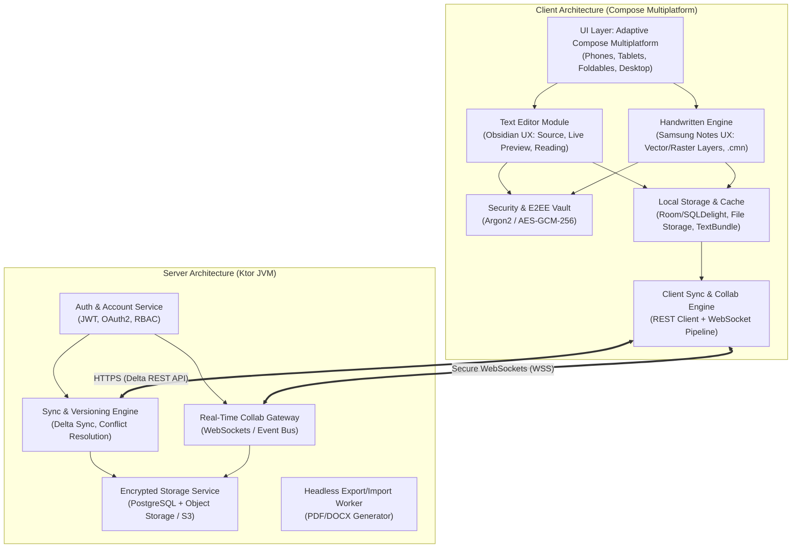
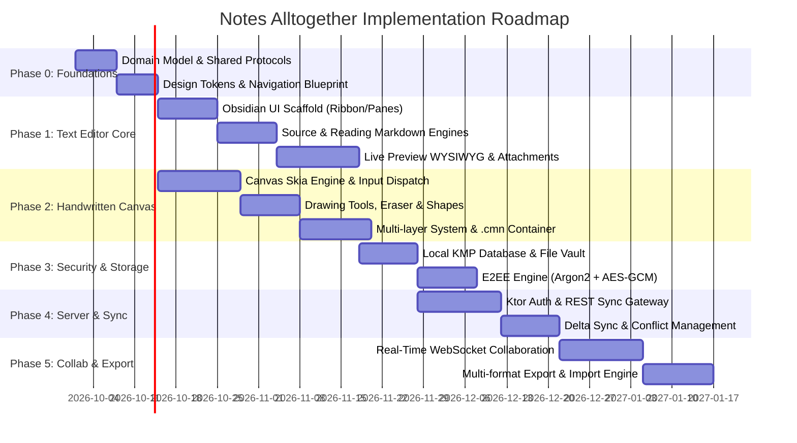

# Comprehensive System Implementation Plan: Notes Alltogether

**Document Version:** 1.0.0  
**Target Systems:** `notesClientApp` (Kotlin Multiplatform / Compose Multiplatform) & `notesServer` (Kotlin / Ktor Server)  
**Reference Design:** Obsidian (Text Editor UI/UX) & Samsung Notes (Handwritten Canvas Engine)  
**Governing Documents:** `commonFiles/features.md`, `commonFiles/ui_ux_handwritten_notes.md`, `commonFiles/ui_ux_text_editor.md`

---

## 1. Executive System Architecture Overview

The **Notes Alltogether** platform is a modern, cross-platform knowledge management and note-taking ecosystem supporting Android, iOS, Desktop (JVM), and Web (Wasm), backed by a reactive Ktor microservice.

---

## 2. Detailed Module Breakdown

### 2.1 Text Editor Module (Obsidian Reference)
* **Visual Workspace Structure:**
  * **Tabbed Interface:** Multi-tab document management on wide viewports (desktop, tablets, unfolded foldables).
  * **Left Ribbon:** High-priority quick actions (New Note, Quick Switcher, Daily Notes, Vault Settings).
  * **Collapsible Left Sidebar:** Hierarchical file explorer, search with regex/tags, bookmarked notes.
  * **Collapsible Right Sidebar:** Document metadata, auto-generated outline (Table of Contents based on H1-H6 headers), interactive tags list.
  * **Customizable Action Toolbar:** Persistent pin/overflow mechanism for formatting tools (bold, italic, strikethrough, code block, quote, tables, callouts).
* **Three Editing Modes:**
  1. *Source Mode:* Raw Markdown syntax editing with syntax highlighting and line numbers.
  2. *Live Preview Mode:* Inline WYSIWYG rendering with clickable checkboxes and formatted styling while typing.
  3. *Reading Mode:* Immutable, read-only rendered document.
* **Media & Attachment Architecture:**
  * Embedded images automatically routed to `.attachments/` or `assets/` relative directories.
  * Drag-and-drop, clipboard paste (`Ctrl+V`/`Cmd+V`), and native gallery/file picker integrations.
  * Seamless on-the-fly packing into `TextBundle` or `.cmn` containers when shared or exported.

### 2.2 Handwritten Notes Module (Samsung Notes Reference)
* **Canvas Core:**
  * High-performance Compose Multiplatform `Canvas` backed by Skia graphics rendering.
  * Infinite or multi-page continuous vertical canvas with pinch-to-zoom, two-finger pan, and rotation.
  * Seamless input dispatch differentiating stylus pressure/tilt and finger interactions.
  * *Explicit Constraint:* Programmatic palm rejection is omitted from initial implementation.
* **Drawing Instruments & Toolset:**
  * Pens: Ballpoint Pen, Fountain Pen, Pencil, Calligraphy Brush, and Highlighter (semi-transparent blending).
  * Vector Eraser: Path/stroke-level erasing (removing individual vectors) and partial raster erasing.
  * Geometric Shape Recognizer/Snapping: Rectangles, Circles/Ovals, Straight Lines, and Wavy Lines.
  * Color Picker & Presets: Hex input, palette swatches, opacity, and customizable stroke thickness.
* **Layer Hierarchy:**
  * Multi-layer stacking: background grid/paper styles (lined, dotted, grid, blank), imported raster image layers, and foreground vector drawing layers.
  * Independent layer visibility toggling, reordering, opacity adjustments, and deletion.
* **Compound Package Format (`.cmn` - Custom Multi-layer Note):**
  * Bundled ZIP-compatible container with custom header magic bytes (`CMN\x01`) and distinct MIME type.
  * Contains `manifest.json` detailing schema version, layers, bounding boxes, Z-indices, and metadata.
  * Vector strokes serialized as compact binary coordinates or SVG path definitions.
  * High-resolution raster images preserved natively as PNG/JPEG.

### 2.3 Local Storage & Serialization
* **Multiplatform Database:** Offline-first caching with SQLDelight or Room KMP for metadata, search indexes, tag directories, and sync timestamps.
* **File System Layer:** Platform-specific file abstractions (Android Scoped Storage / Documents, iOS Application Sandbox, Desktop User Data, Wasm OPFS/IndexedDB).
* **Format Parsers & Bundlers:** Built-in streaming ZIP packager/unpacker for `.cmn` and `TextBundle` formats.

### 2.4 Cloud Synchronization & Conflict Resolution
* **Dual Sync Modes:**
  * *Automatic Sync:* Configurable intervals (e.g., 30s, 2m, on app backgrounding, on network reconnect).
  * *Manual Sync:* Immediate on-demand push/pull via UI action button.
* **Conflict Resolution Strategy:**
  * Three-way merge algorithm with deterministic vector clocks or last-write-wins (LWW) with revision history.
  * Conflicted forks saved alongside the original note (`Note Title (Conflict - Device - Timestamp).md`).

### 2.5 Security & End-to-End Encryption (E2EE)
* **Authentication:** Ktor Authentication using JWT tokens (access + refresh token rotation) and optional biometric unlock (Touch ID / Face ID / Android BiometricPrompt).
* **Zero-Knowledge Protected Notes:**
  * Individual notes or folders encrypted with client-side keys derived via Argon2id from a user-supplied personal vault passphrase.
  * Ciphertext payload: Authenticated AES-GCM-256 with unique 96-bit IV per save.
  * Server has strictly zero visibility into note title, content, or attachments for protected notes.

### 2.6 Real-Time Collaboration & Sharing
* **Room-based WebSockets:** Ktor WebSockets channels for active note sessions.
* **Presence & Collaborative Cursors:** Broadcast collaborator cursor coordinates, active selections, and stroke drawing status.
* **Granular Permissions:** Read-only (Viewer), Commenter, and Read/Write (Editor) access tiers.

### 2.7 Import & Export Pipeline
* **Export Engine:**
  * Markdown/Text notes exported to `.docx`, `.pdf`, `.html`, `.rtf`, `.txt`.
  * Handwritten notes exported to `.pdf` (vector or flattened raster), `.png`, `.jpeg`.
* **Import Engine:**
  * Ingestion of `.docx`, `.doc`, `.pdf` (text extraction and canvas backdrop), `.html`, `.txt`, and `.md`.

---

## 3. Phased Implementation Roadmap

### Phase 0: Architecture, Shared Common Models & Design Setup
- Establish shared data models (`Note`, `NoteMetadata`, `Stroke`, `Layer`, `Manifest`, `SyncPacket`) between client and server.
- Establish UI typography, theming tokens, icon suites, and multiplatform navigation framework.

### Phase 1: Local Text Editor Core (Obsidian UX)
- Build the 3-column responsive layout (Ribbon, Left Sidebar, Editor Canvas, Right Sidebar).
- Implement responsive viewport adaptors (desktop/tablet multi-pane vs phone/folded drawer layout).
- Integrate Markdown parsing, syntax highlighting, and Live Preview rendering.
- Implement the `.attachments/` folder workflow and clipboard paste/drag-and-drop.

### Phase 2: Handwritten Canvas Engine (Samsung Notes UX)
- Implement multiplatform Skia Canvas with zoom/pan and vector stroke rendering.
- Implement Pen, Pencil, Calligraphy Brush, and Vector Path Eraser.
- Implement geometric shape recognition and snapping.
- Build multi-layer manager (raster images vs vector strokes).
- Implement `.cmn` compound container packager/unpacker (`manifest.json` + binary strokes + raster assets).

### Phase 3: Local Persistence, File Management & E2EE Vault
- Integrate SQLDelight/Room KMP for note index and tags.
- Implement local file-system repository with support for standard `.md`, `.txt`, `.rtf`, and `.cmn`.
- Implement client-side Argon2id key derivation and AES-GCM-256 encryption for protected notes.

### Phase 4: Backend Infrastructure & Cloud Synchronization
- Implement Ktor backend authentication (JWT tokens, password hashing, user registration).
- Implement REST API for note metadata, version tracking, and binary chunk uploads.
- Build client background sync worker with manual trigger and configurable periodic sync.
- Implement conflict handling with automatic side-by-side branch generation.

### Phase 5: Real-Time Collaboration & Sharing
- Implement Ktor WebSocket rooms for concurrent document editing.
- Implement operational delta broadcast for text and canvas strokes.
- Add user presence indicators and collaborative cursors.

### Phase 6: Import / Export Engine & Cross-Platform Hardening
- Implement export pipelines (`.docx`, `.pdf`, `.jpeg`, `.png`, `TextBundle`).
- Implement import pipelines (`.docx`, `.pdf`, `.html`, `.md`).
- Validate responsive transitions across Android phones, foldables, tablets, iOS, Desktop, and Wasm.

---

## 4. Gap Analysis: Prerequisites & Missing Enablers

Before development can proceed at full velocity, several foundational assets, integrations, and tools must be set up:

| Domain | Missing Enabler / Prerequisite | Action Required |
| :--- | :--- | :--- |
| **Design & UI/UX** | **Figma Design System & MCP Connection** | Connect Figma MCP server to inspect component tokens, responsive breakpoint behaviors, toolbar icons, and canvas UI kits. |
| **UI Specifications** | **Screen Flow & Navigation Blueprint** | Formalize navigation graph (Navigation Compose Multiplatform / Decompose) including drawer behaviors for foldable devices. |
| **Development Agents** | **Specialized Antigravity Subagents** | Create specialized subagents in `.agents/agents/`: - `editor-architect` (Markdown & WYSIWYG) - `canvas-graphics-specialist` (Skia/Compose Canvas) - `crypto-security-engineer` (E2EE & Key Store) - `sync-backend-engineer` (Ktor WebSockets & DB) |
| **Custom Skills** | **Project-Specific Antigravity Skills** | Author dedicated skills in `.agents/skills/`: - `compose-canvas-drawing` (handling drawing pipelines & Skia paths) - `crypto-vault` (cross-platform crypto primitives) - `cmn-container-format` (ZIP and binary packing specifications) |
| **Data Contracts** | **Common Module Shared Library** | Extract data models and DTOs from `commonFiles` into a shared Gradle module (`common-models`) consumed by both `notesClientApp` and `notesServer`. |
| **Collab Protocol** | **Conflict & Real-time Sync Specification** | Select and specify real-time protocol: CRDT (e.g. Yjs / Automerge port) vs OT vs WebSocket-based stroke/delta broadcasting. |
| **Export Engines** | **Multiplatform Rendering Libraries** | Select cross-platform PDF and DOCX generation libraries suitable for Kotlin Multiplatform / JVM. |

---

## 5. 30 Clarifying Questions for Initial Implementation

### A. General Architecture & Cross-Platform Priorities
1. **Platform Release Tier:** Which platform is the MVP primary target: Android (tablets/foldables/phones), Desktop (Windows/macOS/Linux), iOS, or Web/Wasm?
2. **Shared Code Structure:** Should we convert `commonFiles` into a shared Kotlin Multiplatform Gradle module (`:common-models`) to share DTOs between `notesClientApp` and `notesServer`?
3. **Navigation Framework:** Do you prefer Jetpack Compose Navigation Multiplatform, Decompose, Voyager, or a custom stack router?
4. **Minimum Supported Versions:** What are the minimum OS targets (e.g., Android 8.0+ / API 26+, iOS 15+, JVM 17+)?

### B. Text Editor Module (Obsidian UX)
5. **WYSIWYG Engine Choice:** For Live Preview mode, should we implement a custom Compose rich-text AST parser (e.g., based on multiplatform Markdown parsers like `multiplatform-markdown-renderer`) or build a custom `AnnotatedString` / `VisualTransformation` pipeline?
6. **Tabs Behavior:** On mobile and compact foldables, should tab support be disabled in favor of a single active note with a fast note switcher (modal palette), or should horizontal tab scrolling be maintained?
7. **Action Toolbar Persistence:** Should user toolbar customization (pinned vs overflow actions) be synced per-user to the server or saved strictly in local device preferences?
8. **Tags System:** Should tags support hierarchical nesting (e.g., `#project/phase1/todo`) or only flat tags?
9. **Internal Note Linking (Wikilinks):** Are Obsidian-style wikilinks (`[[Note Name]]`) required in the initial release, or should we strictly support standard Markdown links (`[text](url)`)?

### C. Handwritten Notes Module & Canvas Engine (Samsung Notes UX)
10. **Stroke Smoothing & Interpolation:** Should the canvas implement Catmull-Rom spline or Bezier curve smoothing for drawn points to achieve fluid, natural ink?
11. **Vector Serialization Format:** Should vector strokes inside the `.cmn` container be stored as lightweight JSON coordinate arrays or standardized SVG strings?
12. **Stylus Pressure & Tilt:** Should pen stroke thickness dynamically vary based on stylus pressure and tilt sensors on supported hardware (e.g., S-Pen, Apple Pencil)?
13. **Shape Snapping Behavior:** Should geometric shape recognition occur automatically on stroke completion (drawing a circle and holding) or via a dedicated shape tool mode?
14. **Canvas Extent & Pages:** Is the handwritten canvas an infinite 2D plane, a vertically continuous infinite roll, or fixed-dimension paginated sheets (e.g., A4 / US Letter)?

### D. Security, Passwords & End-to-End Encryption (E2EE)
15. **Vault Passphrase Recovery:** Is E2EE strictly zero-knowledge (loss of passphrase results in permanent data loss), or should an emergency recovery key / mnemonic seed phrase be generated?
16. **Biometric Integration:** Should biometric authentication (fingerprint / Face unlock) act as an encrypted local keystore unlocker for the E2EE passphrase?
17. **Search on Encrypted Notes:** Are protected notes excluded from global search, or should a local encrypted search index be decrypted into memory upon unlocking the vault?
18. **Authentication Provider:** Will authentication be standard email/password, or should we include social providers (Google, Apple, GitHub) or passkeys?

### E. Storage, Synchronization & Conflict Resolution
19. **Local Database Engine:** For local cache and metadata indexing, do you prefer SQLDelight or Room Multiplatform?
20. **Sync Triggering Strategy:** Should background automatic sync occur on a fixed timer (e.g., every 60 seconds), on document change debounce, or strictly on app lifecycle events (focus loss / background)?
21. **Conflict Resolution Preference:** In the event of offline conflict, should the system automatically create a branch file (`Title (Conflict).md`), or present an interactive side-by-side diff resolution screen?
22. **Attachment Sync Limits:** What is the maximum permitted attachment size for image files when syncing to the server?
23. **Data Pruning & Offline Retention:** Should all user notes be cached locally in full (attachments included), or should large attachments download on demand?

### F. Real-Time Collaboration & Sharing
24. **Concurrency Protocol:** For simultaneous text editing, should we use operational CRDTs (such as Y-Kotlin / Automerge) or a lightweight server-authoritative operational lock/delta mechanism?
25. **Handwritten Collab Sync:** For handwritten notes, should collaborators see strokes being drawn in real-time point-by-point, or only after the stroke is completed (`UP` gesture event)?
26. **Public vs Registered Sharing:** Can a note be shared via a public web link (read-only view for non-registered users), or is sharing restricted exclusively to registered accounts?

### G. Import, Export & File System Interoperability
27. **PDF Generation Location:** Should PDF generation be processed locally on the client (using platform graphics/Skia) or delegated to a server-side headless worker for pixel-perfect fidelity?
28. **Word (.doc/.docx) Export Scope:** For `.docx` export, does this apply only to text notes, or should handwritten notes also be embedded as rasterized high-resolution images within the document?
29. **External Folder Binding:** Should the client be capable of opening and watching an arbitrary existing directory on the user's hard drive (like Obsidian vaults), or work strictly inside the app's sandboxed storage?

### H. Tooling, Design Workflow & AI Setup
30. **Figma MCP Integration:** Do you currently have a Figma design link and API access token available for configuring the Figma MCP server in Antigravity?
