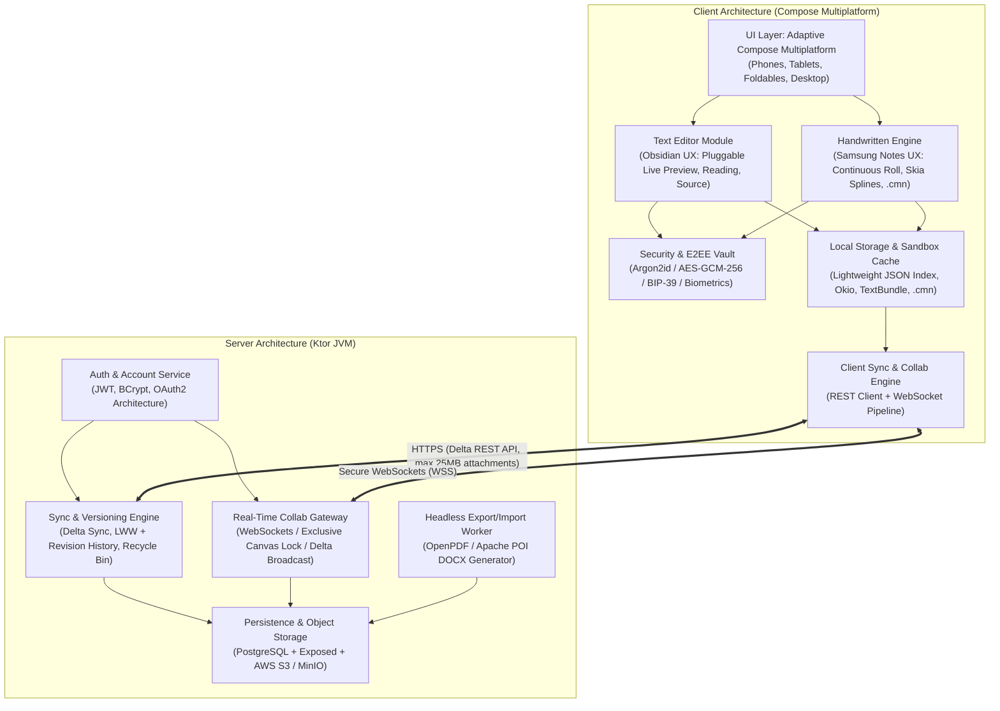
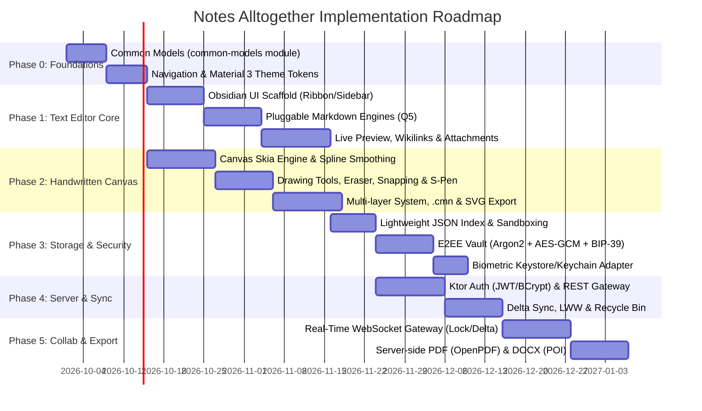

# Comprehensive System Implementation Plan: Notes Alltogether

**Document Version:** 1.1.0  
**Target Systems:** `notesClientApp` (Kotlin Multiplatform / Compose Multiplatform) & `notesServer` (Kotlin / Ktor Server)  
**Reference Design:** Obsidian (Text Editor UI/UX) & Samsung Notes (Handwritten Canvas Engine)  
**Governing Documents:** `commonFiles/features.md`, `commonFiles/ui_ux_handwritten_notes.md`, `commonFiles/ui_ux_text_editor.md`

---

## 1. Executive System Architecture Overview

The **Notes Alltogether** platform is a modern, cross-platform knowledge management and note-taking ecosystem targeting Android (API 28+, optimized for tablets, foldables, and phones), Desktop (JVM 17/21), and iOS (16.0+), backed by a reactive Ktor microservice.

---

## 2. Detailed Module Breakdown

### 2.1 Text Editor Module (Obsidian Reference)
* **Visual Workspace Structure:**
  * **Navigation Architecture:** Tabs omitted across all screen sizes (per Q6 decision); uses a unified single active note canvas with a fast modal Quick Switcher (`Cmd+O`/`Ctrl+O`) and collapsible Left Sidebar.
  * **Left Ribbon:** High-priority quick actions (New Note, Quick Switcher, Daily Notes, Vault Settings).
  * **Collapsible Left Sidebar:** Hierarchical file explorer, search with regex/tags, bookmarked notes, and collapsible nested tags tree.
  * **Collapsible Right Sidebar:** Document metadata, auto-generated outline (Table of Contents based on H1-H6 headers), and document properties.
  * **Customizable Action Toolbar:** Persistent pin/overflow mechanism for formatting tools; customized states stored in DataStore preferences locally with optional server profile sync.
* **Three Editing Modes & Pluggable Engine Architecture:**
  1. *Source Mode:* Raw Markdown syntax editing with syntax highlighting and line numbers.
  2. *Live Preview Mode:* Inline WYSIWYG rendering. Built with a pluggable engine architecture (per Q5 decision):
     - **Default Plugin:** `org.jetbrains.markdown` AST parser with `multiplatform-markdown-renderer`.
     - **Alternative Plugin:** `com.halilibo.compose-richtext` for rich-text component editing.
     - Selectable by the user in app settings.
  3. *Reading Mode:* Immutable, read-only rendered document.
* **Internal Linking & Tags:**
  * Support for both standard Markdown links `[text](url)` and Obsidian-style wikilinks `[[Note Name]]` with auto-complete popup (per Q9).
  * Hierarchical nested tags support (e.g., `#project/phase1/todo`) with tree view in sidebar (per Q8).
* **Media & Attachment Architecture:**
  * Embedded images automatically saved into `.attachments/` relative folder within local sandbox storage.
  * Drag-and-drop, clipboard paste (`Ctrl+V`/`Cmd+V`), and native gallery/file picker integrations.
  * Seamless on-the-fly packing into `TextBundle` or `.cmn` containers when shared or exported.

### 2.2 Handwritten Notes Module (Samsung Notes Reference)
* **Canvas Core:**
  * High-performance Compose Multiplatform `Canvas` backed by Skia graphics rendering.
  * **Layout Bounds:** Vertically continuous scrolling page roll with visual page break dividers (per Q14).
  * Zoom and pan gestures via multi-touch.
  * Seamless input dispatch differentiating stylus pressure/tilt and finger interactions.
  * Dynamic stroke thickness modulation based on stylus hardware pressure and tilt sensors on supported hardware (S-Pen, Apple Pencil) with fallback to uniform stroke on touch/mouse (per Q12).
  * *Explicit Constraint:* Programmatic palm rejection is omitted from initial implementation.
* **Drawing Instruments & Toolset:**
  * Pens: Ballpoint Pen, Fountain Pen, Pencil, Calligraphy Brush, and Highlighter (semi-transparent blending).
  * Vector Eraser: Path/stroke-level erasing (removing individual vectors) and partial raster erasing.
  * Spline Smoothing: Catmull-Rom spline interpolation for smooth, natural ink lines (per Q10).
  * Geometric Shapes: Both a dedicated toolbar shape tool + auto-snapping gesture (draw roughly and hold for 0.5s to snap to perfect shape) (per Q13).
  * Color Picker & Presets: Hex input, palette swatches, opacity, and customizable stroke thickness.
* **Layer Hierarchy:**
  * Multi-layer stacking: background grid/paper styles (lined, dotted, grid, blank), imported raster image layers, and foreground vector drawing layers.
  * Independent layer visibility toggling, reordering, opacity adjustments, and deletion.
* **Compound Package Format (`.cmn` - Custom Multi-layer Note) & SVG Export:**
  * Bundled ZIP-compatible container with custom header magic bytes (`CMN\x01`) and distinct MIME type.
  * Contains `manifest.json` detailing schema version, layers, bounding boxes, Z-indices, and metadata.
  * Vector strokes serialized as compact JSON coordinate arrays (points, pressure, timestamp, tool type, color, stroke width) via `kotlinx.serialization` (per Q11).
  * High-resolution raster images preserved natively as PNG/JPEG.
  * Built-in vector export from `.cmn` container to standardized SVG (per Q11).

### 2.3 Local Storage & Serialization
* **Lightweight Storage Model:** App-managed sandboxed storage using a **custom lightweight JSON file index** (`notes_index.json`) via `kotlinx.serialization` and `okio` (per Q19, Q29).
* **Embedded SQL DBs (Room/SQLDelight):** Replaced by lightweight JSON file index to ensure zero native binary friction, maximum performance, and clean filesystem portability.
* **Preferences Storage:** `androidx.datastore:datastore-preferences-core` for application settings, toolbar customization, and sync preferences.

### 2.4 Cloud Synchronization & Conflict Resolution
* **Sync Triggers:** Hybrid model (per Q20):
  * Debounce after editing (e.g. 5 seconds after typing stops).
  * On app lifecycle events (app backgrounding).
  * Manual sync trigger (button / pull-to-refresh).
  * Configurable periodic timer in the settings screen.
* **Conflict Resolution:** Last-Write-Wins (LWW) based on server timestamp, overwriting older version while maintaining server-side revision history (per Q21).
* **Deletion Policy (Recycle Bin):** Soft delete by default; deleted notes are moved to a Trash / Recycle Bin with a manual emptying mechanism (per Q21).
* **Attachment Constraints:** Maximum 25 MB per attachment file (per Q22).
* **Offline Caching:** Full local cache by default (all notes, `.cmn` packages, and attachments stored locally) with an on-demand download toggle in settings for low-storage devices (per Q23).

### 2.5 Security & End-to-End Encryption (E2EE)
* **Authentication:** Ktor Authentication using JWT tokens (access + refresh token rotation) with BCrypt password hashing; email/password first with extensible OAuth2 architecture (per Q18).
* **Zero-Knowledge Protected Notes:**
  * Client-side keys derived via Argon2id from a user-supplied personal vault passphrase.
  * Ciphertext payload: Authenticated AES-GCM-256 with unique 96-bit IV per note save.
  * **Emergency Recovery Kit:** 12-word BIP-39 mnemonic seed phrase or 256-bit recovery code generated during vault setup (per Q15).
  * **Biometric Unlock:** Optional biometric authentication (Touch ID / Face ID / Android BiometricPrompt) to decrypt the vault key from hardware Keystore/Keychain (per Q16).
  * **Search Privacy:** Title-only search. Note titles remain unencrypted metadata in the JSON index for fast searching, while note body, vector drawings, and attachments are strictly encrypted (per Q17).

### 2.6 Real-Time Collaboration & Sharing
* **Text Editing Concurrency:** Server-authoritative line/block operational delta broadcasting via Ktor WebSockets for MVP (per Q24).
* **Handwritten Notes Concurrency:** Strictly single-editor at a time (exclusive editing lock). Collaborators see the canvas in read-only mode; no simultaneous stroke editing (per Q25).
* **Sharing Model:** Strictly between registered accounts on the server; external sharing is accomplished via exporting to downloadable common files (.pdf, .docx, .html) (per Q26).

### 2.7 Import & Export Pipeline
* **PDF Generation:** Delegated to a server-side headless generation worker (OpenPDF / JVM) via API call for pixel-perfect, identical cross-platform rendering (per Q27).
* **Word (.docx) Export:** Text notes exported as formatted Word documents (with headings, styles, and embedded images); Handwritten notes exported with high-resolution page raster snapshots embedded in the `.docx` (per Q28).
* **Vector Export:** Handwritten notes exportable to standard SVG (per Q11).
* **Import Engine:** Ingestion of `.docx`, `.pdf` (text extraction and canvas backdrop), `.html`, `.txt`, and `.md`.

---

## 3. Phased Implementation Roadmap

---

## 4. Architectural Decisions Register (All 30 Resolved Questions)

### A. General Architecture & Cross-Platform Priorities
1. **Platform Release Tier:** **Android first** (API 28+, optimized for tablets, foldables, and phones), then Desktop (JVM 17/21) and iOS (16.0+).
2. **Shared Code Structure:** Create a dedicated shared Kotlin Multiplatform Gradle module (`:common-models`) used by both `notesClientApp` and `notesServer`.
3. **Navigation Framework:** Jetpack Navigation Compose Multiplatform (`org.jetbrains.androidx.navigation:navigation-compose`).
4. **Minimum Supported Versions:** Android API 28 (Android 9.0+), iOS 16.0+, JVM 17/21.

### B. Text Editor Module (Obsidian UX)
5. **WYSIWYG Engine Choice:** Pluggable engine architecture:
   - **Default:** `org.jetbrains.markdown` + `multiplatform-markdown-renderer` (Option 1).
   - **Secondary Plugin:** `com.halilibo.compose-richtext` (Option 3).
   - Selectable by the user in app settings.
6. **Tabs Behavior:** **No tabs on any screen**; unified workspace with collapsible sidebar and modal Quick Switcher palette (`Cmd+O`/`Ctrl+O`).
7. **Action Toolbar Persistence:** Local device preferences first via DataStore (`androidx.datastore`), with optional backup to user profile on the server.
8. **Tags System:** Hierarchical nested tags (e.g., `#project/phase1/todo`) with collapsible tree view in the sidebar.
9. **Internal Note Linking (Wikilinks):** Support both standard Markdown links `[text](url)` and Obsidian-style wikilinks `[[Note Name]]` with auto-complete popup.

### C. Handwritten Notes Module & Canvas Engine (Samsung Notes UX)
10. **Stroke Smoothing & Interpolation:** Implement Catmull-Rom / Bezier spline interpolation for fluid, natural ink lines.
11. **Vector Serialization Format:** Compact JSON coordinate arrays inside `.cmn` container (points, pressure, timestamp, tool type, color, stroke width) via `kotlinx.serialization`, with full support for export to standardized SVG.
12. **Stylus Pressure & Tilt:** Dynamically modulate stroke thickness and opacity based on stylus pressure and tilt sensors on supported hardware (S-Pen, Apple Pencil) with fallback to uniform stroke on touch/mouse.
13. **Shape Snapping Behavior:** Both a dedicated shape insertion tool in the toolbar + auto-snapping gesture (draw roughly and hold for 0.5s to snap).
14. **Canvas Extent & Pages:** Vertically continuous scrolling page roll with visual page break dividers.

### D. Security, Passwords & End-to-End Encryption (E2EE)
15. **Vault Passphrase Recovery:** Zero-Knowledge with emergency recovery kit: Generate a 12-word BIP-39 mnemonic seed phrase or 256-bit recovery code during vault setup.
16. **Biometric Integration:** Optional biometric unlock (Touch ID / Face ID / Android BiometricPrompt) securely decrypting the vault key from hardware Keystore/Keychain.
17. **Search on Encrypted Notes:** Title-only search. Note titles remain unencrypted metadata in the JSON index for fast searching, while note body, vector drawings, and attachments are strictly AES-GCM-256 encrypted.
18. **Authentication Provider:** Email/Password first for MVP, with extensible OAuth2 architecture ready for Google and Apple Sign-In.

### E. Storage, Synchronization & Conflict Resolution
19. **Local Database Engine:** **Custom lightweight JSON file index on the filesystem** without an embedded SQL database (Room and SQLDelight rejected for client).
20. **Sync Triggering Strategy:** Hybrid model: Debounce after editing (5s) + on app lifecycle events (backgrounding) + manual sync button + configurable periodic timer in settings.
21. **Conflict Resolution Preference:** Last-Write-Wins (LWW) based on server timestamp with server-side revision history. For deletion: Soft delete to a **Recycle Bin** with a manual emptying mechanism.
22. **Attachment Sync Limits:** Maximum 25 MB per attachment file.
23. **Data Pruning & Offline Retention:** Full local cache by default with an on-demand download toggle in settings for low-storage devices.

### F. Real-Time Collaboration & Sharing
24. **Concurrency Protocol:** Server-authoritative line/block operational delta broadcasting via WebSockets for MVP.
25. **Handwritten Collab Sync:** Strictly single-editor at a time (exclusive editing lock). Collaborators see the canvas in read-only mode; no simultaneous stroke editing.
26. **Public vs Registered Sharing:** Exclusively between registered accounts on the server; external sharing via export to common files to download (.pdf, .docx, .html).

### G. Import, Export & File System Interoperability
27. **PDF Generation Location:** Server-side headless generation worker (OpenPDF / JVM) via API call for identical cross-platform output.
28. **Word (.docx) Export Scope:** Formatted Word document for text notes; handwritten notes embedded as high-resolution raster page snapshots.
29. **External Folder Binding:** App-managed sandboxed storage by default, with import/export to external folders.

### H. Tooling, Design Workflow & AI Setup
30. **Figma MCP Integration:** Material 3 code-first UI without external Figma dependency (Figma MCP postponed).
