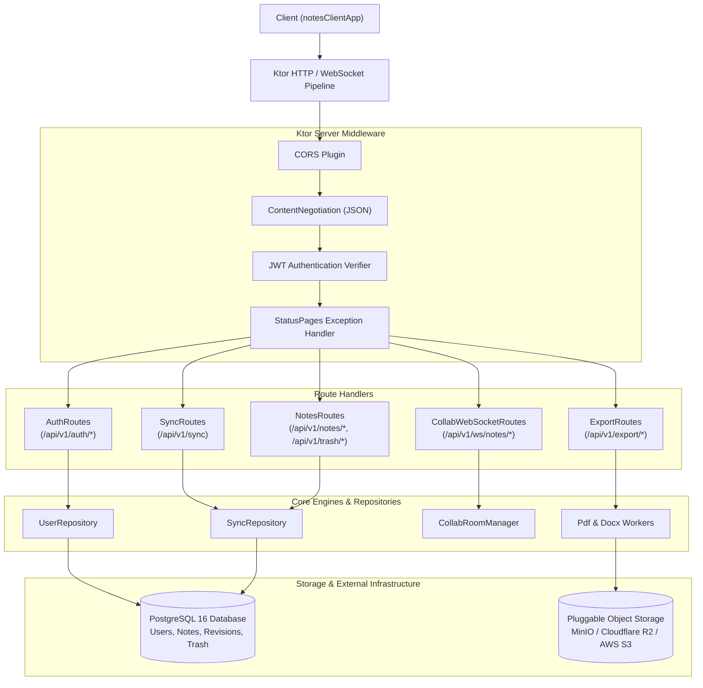
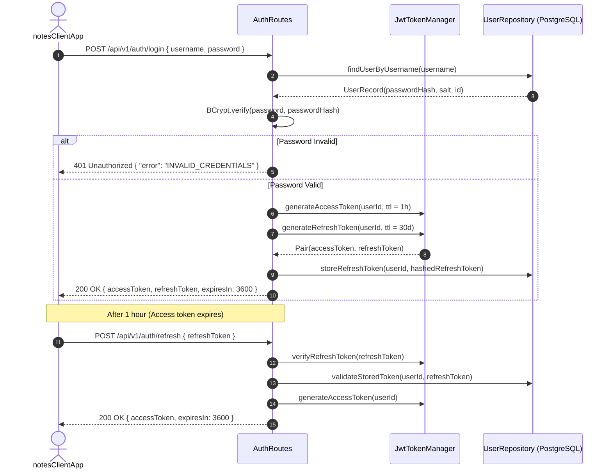
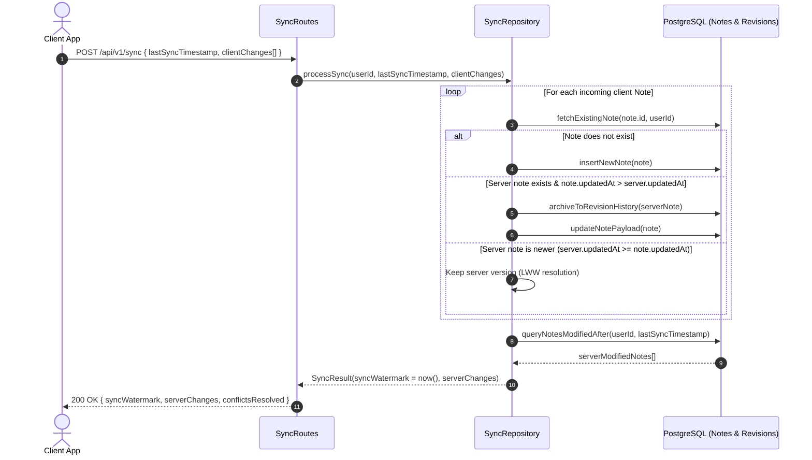
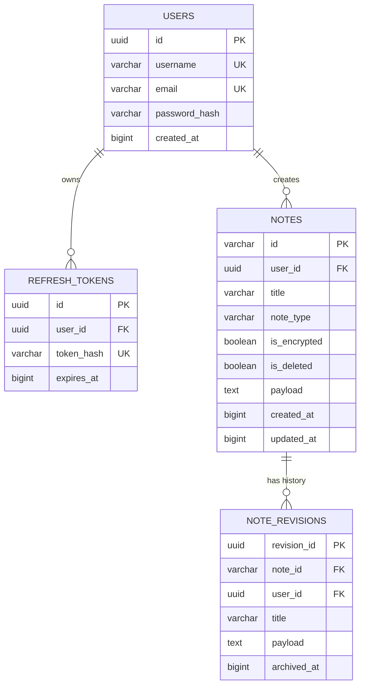
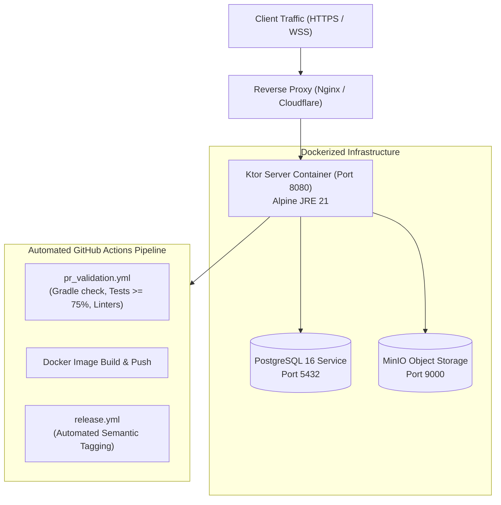

# System Architecture: Notes Alltogether Backend (`notesServer`)

## 1. Architectural Overview

`notesServer` is a high-throughput, containerized backend microservice built with **Kotlin** and **Ktor Server (JVM)**. It serves as the central synchronization engine, authentication authority, real-time collaboration hub, and headless document conversion worker for the Notes Alltogether ecosystem.

### 1.1. Core Capabilities
- **Authentication & Identity Gateway**: JWT access and refresh token management with BCrypt salted password hashing.
- **Delta Synchronization Engine**: Monotonic watermark timestamp filtering, Last-Write-Wins (LWW) conflict resolution, and automatic revision history tracking.
- **Real-Time Collaboration WebSocket Gateway**: Ephemeral co-presence broadcasting, operational text delta routing, and single-editor exclusive canvas locking.
- **Headless Document Export Worker**: Server-side conversion of markdown and vector notes into PDF (OpenPDF) and Microsoft Word DOCX (Apache POI).
- **Zero-Knowledge Blind Storage**: Strict privacy boundary where encrypted notes (`isEncrypted = true`) are treated as opaque binary blobs without server-side decryption capability.

### 1.2. Repository & Package Topography
```text
notesServer/
├── src/main/kotlin/com/notes/server/
│   ├── Application.kt           # Ktor server engine entrypoint & module configuration
│   ├── collab/                  # Real-time WebSocket session management & canvas lock arbitration
│   │   └── CollabRoomManager.kt
│   ├── export/                  # Headless PDF/DOCX exporters & text ingestion workers
│   │   ├── DocxExportWorker.kt
│   │   ├── ImportService.kt
│   │   └── PdfExportWorker.kt
│   ├── models/                  # Server-side entities, DTOs & database table bindings
│   ├── plugins/                 # Ktor plugins: HTTP routing, CORS, ContentNegotiation, StatusPages
│   ├── repository/              # Data persistence repositories (PostgreSQL / Exposed ORM)
│   │   ├── SyncRepository.kt
│   │   └── UserRepository.kt
│   ├── routes/                  # REST & WebSocket endpoint handlers
│   │   ├── AuthRoutes.kt
│   │   ├── CollabWebSocketRoutes.kt
│   │   ├── ExportRoutes.kt
│   │   ├── NotesRoutes.kt
│   │   └── SyncRoutes.kt
│   └── security/                # JWT token signing, verification & password hashing
│       ├── JwtTokenManager.kt
│       └── PasswordHasher.kt
└── docs/                        # Architectural specifications, changelog & dependencies
```

---

## 2. Flow Diagrams

### 2.1. Overall Server Architecture & Pipeline Diagram


### 2.2. Authentication & JWT Token Rotation Lifecycle


### 2.3. Delta Synchronization & LWW Conflict Resolution Flow


---

## 3. API Contracts (Complete Specifications)

### 3.1. Authentication APIs

#### `POST /api/v1/auth/register`
- **Headers**: `Content-Type: application/json`
- **Request Body**:
  ```json
  {
    "username": "alice",
    "email": "alice@example.com",
    "password": "StrongPassword123!"
  }
  ```
- **Success Response (201 Created)**:
  ```json
  {
    "userId": "usr_94a8f1b2",
    "username": "alice",
    "createdAt": 1727438400000
  }
  ```
- **Error Response (409 Conflict)**:
  ```json
  {
    "error": "USERNAME_ALREADY_EXISTS",
    "message": "User with username alice already exists"
  }
  ```

#### `POST /api/v1/auth/login`
- **Headers**: `Content-Type: application/json`
- **Request Body**:
  ```json
  {
    "username": "alice",
    "password": "StrongPassword123!"
  }
  ```
- **Success Response (200 OK)**:
  ```json
  {
    "accessToken": "eyJhbGciOiJIUzI1NiIsInR5cCI6IkpXVCJ9...",
    "refreshToken": "dGhpcy1pcy1hLXJlZnJlc2gtdG9rZW4...",
    "userId": "usr_94a8f1b2",
    "expiresIn": 3600
  }
  ```
- **Error Response (401 Unauthorized)**:
  ```json
  {
    "error": "INVALID_CREDENTIALS",
    "message": "Invalid username or password"
  }
  ```

#### `GET /api/v1/auth/me`
- **Headers**: `Authorization: Bearer <accessToken>`
- **Success Response (200 OK)**:
  ```json
  {
    "userId": "usr_94a8f1b2",
    "username": "alice",
    "email": "alice@example.com",
    "createdAt": 1727438400000
  }
  ```
- **Error Response (401 Unauthorized)**:
  ```json
  {
    "error": "UNAUTHORIZED",
    "message": "Missing or expired Bearer token"
  }
  ```

### 3.2. Delta Synchronization & Revision APIs

#### `POST /api/v1/sync`
- **Headers**: `Authorization: Bearer <accessToken>`, `Content-Type: application/json`
- **Request Body**:
  ```json
  {
    "lastSyncTimestamp": 1727438400000,
    "clientChanges": [
      {
        "id": "note_01HXYZ",
        "title": "Architecture Blueprint",
        "noteType": "MARKDOWN",
        "isEncrypted": false,
        "isDeleted": false,
        "updatedAt": 1727439100000,
        "payload": "# High Level System Design\n..."
      }
    ]
  }
  ```
- **Success Response (200 OK)**:
  ```json
  {
    "syncWatermark": 1727439150000,
    "serverChanges": [
      {
        "id": "note_02MNO",
        "title": "Server Deployment",
        "noteType": "MARKDOWN",
        "isEncrypted": false,
        "isDeleted": false,
        "updatedAt": 1727439120000,
        "payload": "Dockerized container on Port 8080"
      }
    ],
    "conflictsResolved": []
  }
  ```
- **Error Response (400 Bad Request)**:
  ```json
  {
    "error": "INVALID_SYNC_PAYLOAD",
    "message": "Malformed note change payload"
  }
  ```

#### `GET /api/v1/notes/{id}/revisions`
- **Headers**: `Authorization: Bearer <accessToken>`
- **Parameters**: `id` (path, string)
- **Success Response (200 OK)**:
  ```json
  {
    "noteId": "note_01HXYZ",
    "revisions": [
      {
        "revisionId": "rev_01A",
        "updatedAt": 1727438000000,
        "title": "Architecture Blueprint (Draft)",
        "payload": "# Draft Architecture\n..."
      }
    ]
  }
  ```

### 3.3. Recycle Bin / Trash Lifecycle APIs

#### `GET /api/v1/trash`
- **Headers**: `Authorization: Bearer <accessToken>`
- **Success Response (200 OK)**:
  ```json
  {
    "trashNotes": [
      {
        "id": "note_03OLD",
        "title": "Deprecated Spec",
        "deletedAt": 1727435000000
      }
    ]
  }
  ```

#### `POST /api/v1/trash/{id}/restore`
- **Headers**: `Authorization: Bearer <accessToken>`
- **Success Response (200 OK)**:
  ```json
  {
    "id": "note_03OLD",
    "restored": true,
    "updatedAt": 1727439300000
  }
  ```

#### `DELETE /api/v1/trash/{id}`
- **Headers**: `Authorization: Bearer <accessToken>`
- **Success Response (200 OK)**:
  ```json
  {
    "id": "note_03OLD",
    "purged": true
  }
  ```

### 3.4. Real-Time Collaboration WebSocket Gateway

#### `WS /api/v1/ws/notes/{noteId}`
- **Query Parameter**: `token=<accessToken>`
- **Incoming Messages**:
  - `{"type": "CANVAS_LOCK_REQUEST", "layerId": "layer_01"}`
  - `{"type": "TEXT_OP", "delta": {"retain": 10, "insert": "Hello "}}`
  - `{"type": "CURSOR_MOVE", "x": 120.5, "y": 450.0}`
- **Outgoing Broadcasts**:
  - `{"type": "PRESENCE", "activeUsers": [{"userId": "usr_94a8f1b2", "color": "#4F46E5"}]}`
  - `{"type": "CANVAS_LOCK_GRANTED", "layerId": "layer_01", "lockedBy": "usr_94a8f1b2"}`
  - `{"type": "CANVAS_LOCK_DENIED", "layerId": "layer_01", "lockedBy": "usr_other"}`

### 3.5. Document Export & Import APIs

#### `POST /api/v1/export/pdf`
- **Headers**: `Authorization: Bearer <accessToken>`, `Content-Type: application/json`
- **Request Body**:
  ```json
  {
    "noteId": "note_01HXYZ",
    "title": "Architecture Blueprint",
    "contentMarkdown": "# System Design\n...",
    "svgVectorDrawings": ["<svg xmlns=...>...</svg>"]
  }
  ```
- **Success Response (200 OK)**:
  - **Headers**: `Content-Type: application/pdf`, `Content-Disposition: attachment; filename="Architecture_Blueprint.pdf"`
  - **Body**: Binary PDF byte stream.

#### `POST /api/v1/export/docx`
- **Headers**: `Authorization: Bearer <accessToken>`, `Content-Type: application/json`
- **Request Body**: Identical to PDF export.
- **Success Response (200 OK)**:
  - **Headers**: `Content-Type: application/vnd.openxmlformats-officedocument.wordprocessingml.document`, `Content-Disposition: attachment; filename="Architecture_Blueprint.docx"`
  - **Body**: Binary DOCX byte stream.

---

## 4. Module & Function Definitions

### 4.1. Security & Tokens (`com.notes.server.security`)
- **`JwtTokenManager`**:
  - `generateAccessToken(userId: String): String`: Signs HMAC-SHA256 JWT with 1-hour expiration and subject `userId`.
  - `generateRefreshToken(userId: String): String`: Generates cryptographically secure 256-bit random token.
  - `verifyToken(token: String): DecodedJWT?`: Validates token signature, expiration, and issuer. Returns null on expired or tampered token.
- **`PasswordHasher`**:
  - `hash(password: String): String`: Generates BCrypt hash with 12 salt rounds.
  - `verify(password: String, hash: String): Boolean`: Constant-time verification preventing timing attacks.

### 4.2. Synchronization Engine (`com.notes.server.repository.SyncRepository`)
- **`processSync(userId: String, watermark: Long, changes: List<NoteSyncDTO>): SyncResponse`**:
  - Inspects incoming client modifications against server PostgreSQL database.
  - Applies LWW rule: if incoming note has strictly higher `updatedAt`, archives current database note to `NoteRevisionsTable` and overwrites active note.
  - Queries all notes for `userId` modified after `watermark` and returns them as `serverChanges`.
  - *Error Fallback*: Catches database concurrency exceptions and rolls back transaction cleanly.

### 4.3. Real-Time Collaboration Hub (`com.notes.server.collab.CollabRoomManager`)
- **`joinRoom(noteId: String, session: CollabSession)`**:
  - Binds client WebSocket session to room channel; broadcasts updated user list.
- **`requestCanvasLock(noteId: String, layerId: String, userId: String): Boolean`**:
  - Grants exclusive editing lock for vector layer if currently unreserved or owned by the same user.
  - Auto-releases lock after inactivity timeout (default 30 seconds).

### 4.4. Headless Exporters (`com.notes.server.export`)
- **`PdfExportWorker`**:
  - `generatePdf(title: String, markdown: String, svgs: List<String>): ByteArray`
  - Utilizes OpenPDF to render typography, table structures, headings, and converts SVG vectors into embedded high-DPI graphics.
- **`DocxExportWorker`**:
  - `generateDocx(title: String, markdown: String, svgs: List<String>): ByteArray`
  - Uses Apache POI to assemble standard OpenXML document paragraphs, bullet lists, and vector graphics.

---

## 5. Security & Authorization Architecture

### 5.1. Authentication Architecture
- **JWT Standard**: Stateless access tokens signed with a 512-bit secret key (`JWT_SECRET`).
- **Token Expiry**:
  - Short-lived Access Token: 60 minutes.
  - Long-lived Refresh Token: 30 days with revocation on sign-out or password change.
- **Password Protection**: BCrypt algorithm with 12 salt rounds.

### 5.2. Zero-Knowledge Blind Data Store
- Protected notes marked with `isEncrypted = true` store encrypted payloads directly in `payload`.
- The server does NOT possess user encryption keys and performs zero introspection of encrypted payloads.
- Server provides encrypted blob synchronization without violating end-to-end privacy guarantees.

---

## 6. Feature Toggles & Configuration

Configuration is managed declaratively via environment variables and `application.conf`:

| Variable | Description | Default | Governing Component |
| :--- | :--- | :--- | :--- |
| `PORT` | HTTP/WS listen port | `8080` | `Application.kt` |
| `JWT_SECRET` | Secret key for JWT signing | *Required* | `JwtTokenManager` |
| `DATABASE_URL` | PostgreSQL connection URL | `jdbc:postgresql://localhost:5432/notes` | `DatabaseFactory` |
| `STORAGE_PROVIDER` | Object storage engine (`S3`, `R2`, `MINIO`, `LOCAL`) | `MINIO` | Object Storage Gateway |
| `CANVAS_LOCK_TTL` | Inactivity lock timeout (seconds) | `30` | `CollabRoomManager` |
| `REVISION_LIMIT` | Max revisions stored per note | `20` | `SyncRepository` |

---

## 7. Data Models & Database Schemas

### 7.1. Database Schema Diagram (PostgreSQL / Exposed ORM)


### 7.2. Exposed Table Definitions
```kotlin
object NotesTable : Table("notes") {
    val id = varchar("id", 64)
    val userId = uuid("user_id").references(UsersTable.id, onDelete = ReferenceOption.CASCADE)
    val title = varchar("title", 255)
    val noteType = varchar("note_type", 32)
    val isEncrypted = bool("is_encrypted").default(false)
    val isDeleted = bool("is_deleted").default(false)
    val payload = text("payload")
    val createdAt = long("created_at")
    val updatedAt = long("updated_at")

    override val primaryKey = PrimaryKey(id)
}
```

---

## 8. Synchronization & Concurrency Strategy

1. **Watermark Delta Sync**: Efficient synchronization transmits only delta changes using UTC epoch milliseconds.
2. **Conflict Resolution Policy**:
   - Monotonic timestamps govern resolution via Last-Write-Wins (LWW).
   - Whenever an update overwrites an existing note version, the superseded content is automatically written to `note_revisions`, ensuring zero accidental data loss.
3. **Canvas Locking Concurrency**:
   - Real-time handwritten drawing enforces single-writer locking per canvas layer to prevent incompatible Bézier curve merging artifacts.
   - Locks automatically expire after 30 seconds of inactivity if not refreshed with a heartbeat ping.

---

## 9. Deployment Architecture



- **Containerization**: Multi-stage `Dockerfile` creating a lightweight, secure image based on `eclipse-temurin:21-jre-alpine`.
- **Local Dev Orchestration**: `docker-compose.yml` pre-configures PostgreSQL and MinIO for immediate local testing.
- **Health Probes**: Liveness and readiness endpoints available at `GET /health`.
